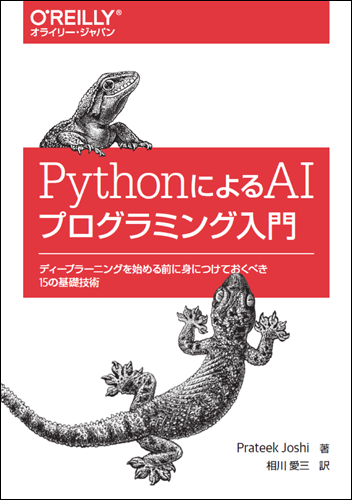

# PythonによるAIプログラミング入門

---



---

本リポジトリはオライリー・ジャパン発行書籍『[PythonによるAIプログラミング入門](http://www.oreilly.co.jp/books/9784873118727/)』（原書名『[Artificial Intelligence with Python](https://www.packtpub.com/big-data-and-business-intelligence/artificial-intelligence-python)』）のサポートサイトです。


## サンプルコード

### ファイル構成

|フォルダ名   |説明  |
|:--          |:--   |
|`Chapter 1`  |1章で使用するデータと`.ipynb`形式のノートブック   |
|`...`        |`...`                                             |
|`Chapter 16` |16章で使用するデータと`.ipynb`形式のノートブック  |
|`Appendix A` |付録Aで使用するデータと`.ipynb`形式のノートブック |

サンプルコードの解説は本書籍をご覧ください。

## Pythonと外部ライブラリ

ソースコードを実行するには、下記のソフトウェアが必要です。

* Python 3
* NumPy
* SciPy
* Matplotlib
* Jupyter Notebook

本書では、以下の環境で動作確認しました。

* Windows 10
* Anaconda3（Python 3.6, 3.7）

Anacondaでは、次のパッケージはインストール済みです。

```
numpy
scipy
scikit-learn
matplotlib
jupyter
sympy
nltk
pandas
```

Anacondaでパッケージを追加する場合には、`pip`よりも`conda`を優先して使います。
`conda install`でインストールできるパッケージは次のとおりです。

```
gensim
cvxopt
opencv
tensorflow
```

`pip install`でインストールする必要があるパッケージは次のとおりです。

```
pandas_datareader
kanren
simpleai
deap
easyai
hmmlearn
pystruct
neurolab
gym
```

PyPIにあるpystruct 0.3.2はPython 3.7に対応していないため、インストールに失敗します。古いCythonによって生成された`src/utils.c`がPython3.7と互換性がないためです。次のようにソースファイルからインストールしてください。インストールにはCコンパイラが必要です。Windowsの場合は、Visual Studio 2017コミュニティー版をインストールしておいてください。

1. https://github.com/pystruct/pystruct を開き、[Clone or Download]をクリックしてソースファイルを取得します。

2. ソースファイルのあるディレクトリに移動してから、次のようにCythonを実行して、`src/utils.c`を生成します。
```
cd src
cython utils.pyx 
```

3. 元のディレクトリに戻って、パッケージをインストールします。
```
cd ..
python setup.py install
```

AIは進歩が激しいため、頻繁にパッケージがバージョンアップされます。
そのため本書のサンプルコードを実行すると、警告やエラーが表示されることがあります。
そのような場合には、まずパッケージのバージョンを最新化してください。
パッケージのバージョンアップは、次のコマンドで行います。

```
// pipの場合：
$ pip install -U パッケージ名

// Anacondaの場合：
$ conda update パッケージ名
```

APIがdeprecated（廃止予定）であるという警告が表示された場合には、
警告メッセージを読んで新しいAPIに書き換えなければならないこともあります。


## 実行方法

端末に次のように入力して、`jupyter notebook`を起動してください。

```bash
$ jupyter notebook
```

すると、Webブラウザが起動してjupyterのページが開き、
jupyterを起動したフォルダのファイル一覧が表示されます。

サンプルコードを開き、
画面上部の［Cell］メニューから選択するか画面上部のボタンを押して実行します。

右上のメニューから［New▼］→［Python 3］を選択すると、
「Untitled」タブが新たに開きます。
`In [ ]:`の右側にPythonのコードを記述し、
画面上部の［Cell］メニューから選択するか画面上部のボタンを押して実行することもできます。

## 正誤表

下記の誤りがありました。お詫びして訂正いたします。

本ページに掲載されていない誤植など間違いを見つけた方は、japan@oreilly.co.jpまでお知らせください。

### 第1刷

#### ■14章 P.342 訳注
**誤**
```
C:\Users\aizo\Anaconda3\lib\site-packages\nurolab\__init__.py
```
**正**
```
C:\Users\aizo\Anaconda3\lib\site-packages\neurolab\__init__.py
```

#### ■A.1 P.391 コード
**誤**
```
_, contours, _ = cv2.findContours(gray_image, cv2.RETR_TREE,
                               cv2.CHAIN_APPROX_SIMPLE)
```
**正**
```                               
contours, _ = cv2.findContours(gray_image, cv2.RETR_TREE,
                               cv2.CHAIN_APPROX_SIMPLE)[-2:]
```